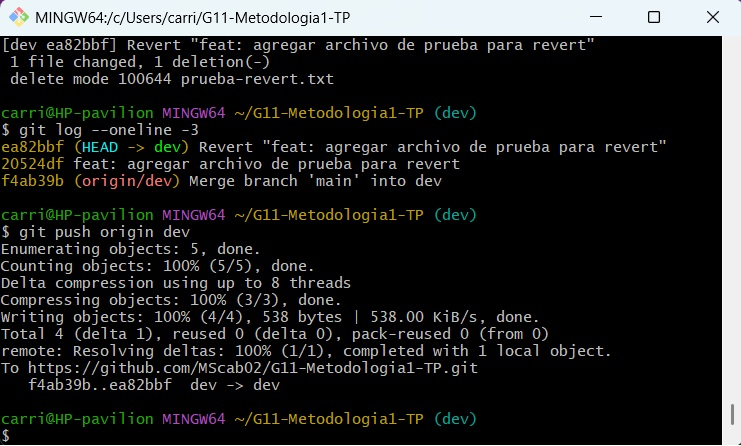

# Estadisticas del repositorio

Este documentos presenta distintas estadisticas obtenidas del repositorio junto con los comandos utilizados para calcularlas.

Estas estadisticas estan actualizadas hasta la fecha **Miercoles 10 a 7:36pm**

## Integrante con mayor commits

Integrante: **FeverDream999**

Cantidad de commits: **22**

**Comando utilizado**

`git shortlog -sn --all`

## Cantidad total de merges realizados

Cantidad de merges: **2**

**Comando utilizado**

`git log --merges --oneline | wc -l`

## Cantidad de conflictos producidos

Cantidad de conflictos: **4553b2d docs: documentar conflicto y agregar evidencias
e4b4abc (Kloster) feat(conflictos): explicar resolución de conflictos en Git**

**Comando utilizado**

`git log --all --grep="conflict" --oneline`

## Cantidad de ramas existentes en el repositorio

Cantidad de ramas: **8** (ignorando ramas locales)

**Comando utilizado**

`git branch -a | wc -l`

## Commit con mayor cantidad de archivos modificados

Commit con mayor cantidad de archivos modificados: **feat: git-branch terminado**

**Comando utilizado**

`git log --stat`

## Conflicto previo a a su resolucion

Adjuntar captura de pantalla (avisar)

**Comando utilizado**

`git log --all --grep="conflict"`

## Conflictos registrados

Cantidad de conflictos producidos: 1.

Durante la integración de la rama matias con la rama dev se produjo un conflicto en el archivo indice.md, el cual fue resuelto manualmente.

Hash del commit asociado:

f7df376

Evidencias

## Uso de git revert

Se creó un commit de prueba con el objetivo de demostrar el funcionamiento del comando `git revert`.

Commit creado:
- 20524df - feat: agregar archivo de prueba para revert

Posteriormente se ejecutó:

git revert 20524df

Git generó automáticamente un nuevo commit que deshace los cambios sin alterar el historial:

- ea82bbf - Revert "feat: agregar archivo de prueba para revert"

Evidencias

